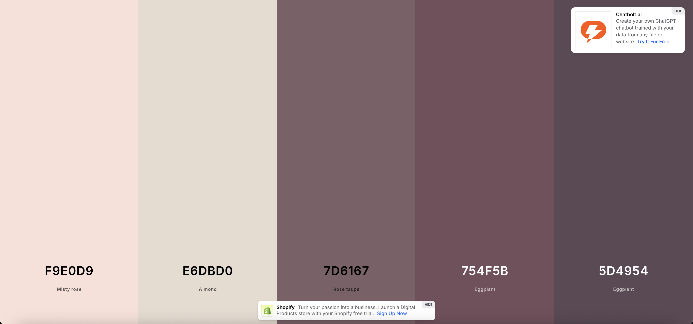

Assignment 3 - Persistence: Two-tier Web Application with Database, Express server, and CSS template
===
## RSVP App (Future Name: Night Owl) Brandon Yeu
Brandon Yeu
Deployed Link: https://a3-brandonyeu-production.up.railway.app/index.html
Username: brandon1
Password: brandon1
OR Create your own account using Sign Up

This app allows users to RSVP to ongoing events, and add themselves to a guestlist. Users can create an account and view their RSVPs. 

One challenge that I faced were learning how MongoDBs work, I had understood them conceptually but had never used them in practice before. I also had some trouble increasing my score on the Google Lighthouse test, but I learned that some loading lags were caused by my Chrome extensions. 

The authentication strategy that I chose was just username and password because it does not require users to have any accounts on any other platforms to be able to use my platform.

The CSS framework I chose was Tailwind because it is applicable to all components/elements and quick to create a product. However, there are parts of the CSS that made more sense to keep in main.css, so I used a combination of generic CSS and Tailwind.

Middleware that I use:
- body-parser: Processes incoming requests so the form inputs and JSON data can be accessed
- express-session: Manages session state on the server, storing and retrieving session data like user status information so that the user remains authenticated across requests
- express.static: Serves static files such as CSS, JavaScript, and images so that the client can load assets without defining routes for them
- requireLogin: checks if req.session.user exists. If no user is logged in, it blocks the request with a 401 Unauthorized response. Otherwise, it allows the requests to continue. It ensures that only authenticated users can access /results, /submit, /edit, and /delete

## Technical Achievements
- **Tech Achievement 1**: I used username and password logic to create users, and store data based on users.
- **Tech Achievement 2**: I deployed using Railway to host my frontend and backend
- **Tech Achievement 3**: I used Tailwind CSS and generic CSS to style my pages
- **Tech Achievement 4**: Received 100% on all 4 Google Lighthouse tests (Performance, Best Practices, Accessibility, and SEO)

- **Tech Achievement 5**: Server, created using Express
- **Tech Achievement 6**: Persistent data storage in between server sessions using mongodb Atlas
- **Tech Achievement 7**: Results functionality which shows all of the form submissions from the currently logged in user
- **Tech Achievement 8**: Form functionality to add data
- **Tech Achievement 9**: Form validation and input handling
- **Tech Achievement 10**: Functionality to edit or delete rows of data
- **Tech Achievement 11**: User authentication (login/logout)
- **Tech Achievement 12**: Error handling and feedback
- **Tech Achievement 13**: Use of environment variables to protect sensitive app information
- **Tech Achievement 14**: Send cards for user information
- **Tech Achievement 15**: Server function requires login and checks that the client is an authenticated user before allowing access

### Design/Evaluation Achievements
- **Design Achievement 1**: I followed the following tips from the W3C Web Accessibility Initiative...
- 1. I provided informative, unique page titles to inform users of what their current page is and it's function. This is still visible from other tabs.
- 2. I used clear and simple language with my form labels ("Your Name," "Event," "Additional Guests," i.e.) and on the form button "Submit" as opposed to something like "Go"
- 3. I used headings to express meaning and create structure (h1, h2, etc.)
- 4. I provided instructions in the form by including placeholders and input labels so that users know what to put
- 5. I ensured sufficient color contrast by changing colors in my nav bar and buttons
- 6. I used color with care by not solely relying on color to represent states. Hovering in the nav bar changes the text
- 7. I made interactive elements highly identifiable by making buttons have high contrast colors with the background and hover effects
- 8. I used a clear and consistent layout by keeping the nav bar consistent across all pages 
- 9. I associated labels with the form inputs so that users read the label when focusing on the input
- 10. I provided clear focus indication by including the focus ring so that users can see which input field is active
- 11. I used headings and landmarks so that users can quickly jump between sections
- 12. I made sure form elements have required attributes to help preserve the data and validate submissions

- **Design Achievement 2**: Color palette used across pages for consistency and visual appeal

- **Design Achievement 3**: Color palette matches background image for visual appeal
- **Design Achievement 4**: Responsive layout through Tailwind responsive utility to adapt to desktop or mobile devices
- **Design Achievement 5**: Consistent theming of element designs (rounded corners, certain semi-transparent elements)
- **Design Achievement 6**: Intuitive navigation layout with nav bar for users to easily move around pages
- **Design Achievement 7**: Form usability and clarity with organized form fields, labels, spacing, and grouping
- **Design Achievement 8**: Hover and focus interactions to help the user focus on specific items
- **Design Achievement 9**: Results page designed to be easy to read and interpret
- **Design Achievement 10**: Actions on Results page clearly identified and understood
- **Design Achievement 11**: Send cards for user notifications to draw their attention to them
- **Design Achievement 12**: How my Site uses the CRAP principles:
- 1. **Contrast**: Contrast plays a significant role in my site's design, since it helps guide the user's eyes to the most important elements and makes the interface more accessible. The elements that receive the most emphasis are the page titles and the main action buttons. For example, on the RSVP form, the "Submit" button contrasts strongly against the darker background of the form card, ensuring that users immediately know how to complete the form. Likewise, the navigation bar text uses a light color against a darker background, making the links easy to read while emphasizing the primary site structure. I also applied hover states to both links and buttons tofurther enhance contrast during interaction. This use of color and emphasis ensures that important actions and sections stand out visually, guiding users smoothly through each page.
- 2. **Repetition**: Repetition helps build consistency and familiarity across the different pages of my site. I repeated the same color palette, typography, and rounded card layouts throughout the Home, Results, and Account pages, which unifies the design and makes the site feel cohesive. For instance, the form card on the RSVP pages uses the same rounded edges, background transparency, and shadowing that appear in other content cards. Similarly, the navigation bar is repeated in the same style and placement across all pages, so users do not need to relearn navigation cues. Repeated hover effects for links and buttons also give the site a consistent interactive feel. This repetition reduces cognitive load for the user because once they learn how to interpret or interact with one element, they can easily apply that understanding elsewhere.
- 3. **Alignment**: Alignment was essential to making the site feel organized and professional. I aligned form labels to the left, which improves readability and ensures that users can quickly scan down the fields. Input boxes are also consistently aligned under their corresponding labels, creating a clean vertical flow through the RSVP form. The navigation bar aligns its elements horizontally in two distinct groups, page links on the left and account link on the right, which help establish hierarchy. On the results page, RSVP entries are organized in aligned rows and columns, which increases clarity and reduces visual clutter. By maintaining consistent alignment, I not only improved the overall organization of the site but also created subtle contrast between grouped content and the surrounding whitespace, further highlighting important areas.
- 4. **Proximity**: Proximity was used to organize visual information and make relationships between elements more obvious. For example, within the RSVP form, I grouped related inputs together. The radio buttons for event selection are placed closely under the "Event" label, making it clear they belong to the same choice set. Similarly, each form label is positioned near its input box, so users immediately understand the connection. On the results page, RSVP entries are separated with spacing and card-like containers, which group information for each guest while preventing confusion between different submissions. Even in the navigation bar, spacing between "Home," "Results," and "Account" establishes that they are separate navigational links, while their shared proximity within the bar shows that they belong to the same functional category. This thoughtful grouping makes the interface easier to scan and understand quickly. 